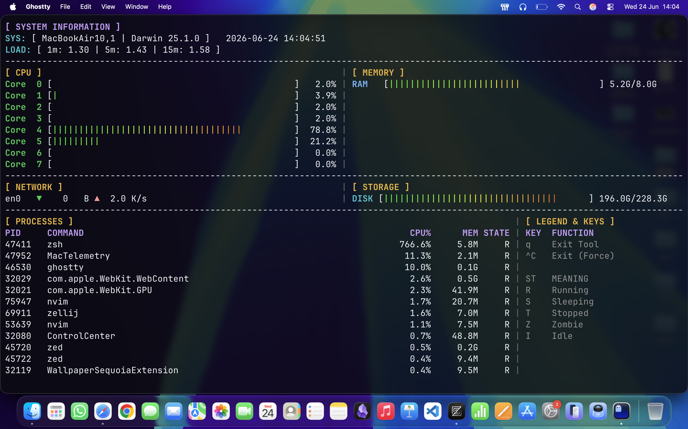

# MacTelemetry: High-Performance macOS System Core Monitor

MacTelemetry is a lightweight, low-overhead Terminal User Interface (TUI) performance dashboard engineered explicitly for macOS in modern C++17. Operating completely without heavy script wrappers, Python dependencies, or generic polling utilities, MacTelemetry connects directly to native XNU kernel subsystems, Mach microkernel primitives, and BSD subsystem layers.

Designed as a high-density, multi-pane asymmetrical terminal grid, MacTelemetry handles parallel data acquisition using isolated worker threads to maintain true performance metrics without impacting the hardware statistics it measures.

---

## Technical Architecture & Grid Layout

The MacTelemetry rendering engine calculates your active shell layout dimensions dynamically via terminal ioctl handles, splitting and padding data vectors into structured columns that adapt instantly to window resizing.

<p align="center">
  
</p>

---

## Key Technical Capabilities

- **Mach Core Synchronization Engine**: Directly maps processor structures using host_processor_info to parse hardware clock states. Computes microsecond delta values across execution samples, eliminating visual values above 100% or below 0%.
- **Asymmetric Grid Matrix**: Splices Row 4 layout configurations into a strict 75% process list block and a 25% static glossary side-panel to maintain optimal legibility on compact terminal dimensions.
- **Dynamic Network Auto-Scaling**: Eliminates flat 0.0 throughput fields by reading raw bytes directly from BSD network descriptors (getifaddrs) and automatically re-scaling text layouts between B, K/s, M/s, and G/s based on link weights.
- **Proportional Column Truncation**: Binds process list binary strings (libproc) precisely to custom string dimensions, truncating names with trailing indicator blocks (...) to preserve strict column alignment.
- **Thread-Isolated UI Controller**: Moves event key polling loops into an autonomous terminal execution state (termios), working with standard conditional variable threads to guarantee instant frame teardown when pressing q or Ctrl + C.
- **256-Color Spectral Ramps**: Interpolates color codes smoothly across the terminal's 256-color cube, creating a fluid color shift (Green -> Yellow -> Red) inside the ASCII bars based on active performance stress.

---

## Compilation & Toolchain Operations

MacTelemetry leverages system properties native to Apple's Darwin core.

### Prerequisites

- **OS**: macOS 10.15 (Catalina) through modern versions running on Apple Silicon (M1/M2/M3/M4 Architecture) or Intel Core chips.
- **Compiler**: Clang++ supporting C++17 or later.
- **Environment**: Toolchain utilities must be active (xcode-select --install).

### Build Lifecycle Commands

An incremental, multi-target Makefile handles conditional builds via object caching, separates development and optimized production environments, and builds the target executable cleanly into an isolated bin directory:

```bash
# Build the production target with full optimizations inside bin/MacTelemetry
make

# Build the development target with debug symbols and unoptimized flags
make build

# Compile and execute the optimized monitoring binary instantly
make run

# Wipe the object cache folder and final output binary directory entirely
make clean

# Force clean and compile the full optimized production environment from scratch
make rebuild
```

---

## Directory Structure

```text
mac-monitor/
├── Makefile                # Multi-target incremental build configuration script
├── include/
│   ├── sys_info.hpp        # Data struct definitions & kernel call contracts
│   └── ui_renderer.hpp     # Terminal dimension trackers & grid rendering parameters
└── src/
    ├── main.cpp            # Thread management entry point & initialization loop
    ├── sys_info.cpp        # Mach/BSD low-level metric implementation definitions
    └── ui_renderer.cpp     # Spectral gradient math & layout padding algorithms
```

---

## Subsystem Metric Map

| Terminal Component | Core System API Calls / Headers                          | Metric Parsing Calculations                                                                   |
| :----------------- | :------------------------------------------------------- | :-------------------------------------------------------------------------------------------- |
| **System Info**    | `sysctlbyname("hw.model")`, `getloadavg()`               | Extracts physical model identifier strings and job execution queue arrays.                    |
| **CPU Core**       | `host_processor_info(..., PROCESSOR_CPU_LOAD_INFO)`      | Differential sampling tracking changes in hardware ticks (user, system, nice, idle).          |
| **Memory**         | `host_statistics64(..., HOST_VM_INFO64)`                 | Combines wired, active, and compressed pages multiplied by your hardware's `host_page_size`.  |
| **Network**        | `getifaddrs()`, scanning specific `AF_LINK` loops        | Tracks incoming and outgoing interface socket byte properties (`ifi_ibytes` / `ifi_obytes`).  |
| **Storage**        | `getmntinfo(..., MNT_NOWAIT)`, `statfs` structures       | Evaluates active physical disk sectors specifically filtered for local `apfs` drive targets.  |
| **Processes**      | `proc_listpids()`, `proc_pidinfo(..., PROC_PIDTASKINFO)` | Aggregates accurate process resident size (`pti_resident_size`) and delta process CPU usages. |

---

## Repository License

Distributed globally under the terms of the [MIT License](./LICENSE). Review the raw template records for modifications or open-source branch derivatives.
